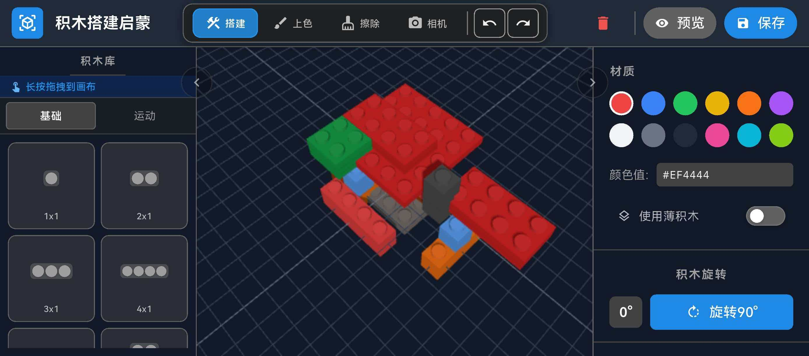
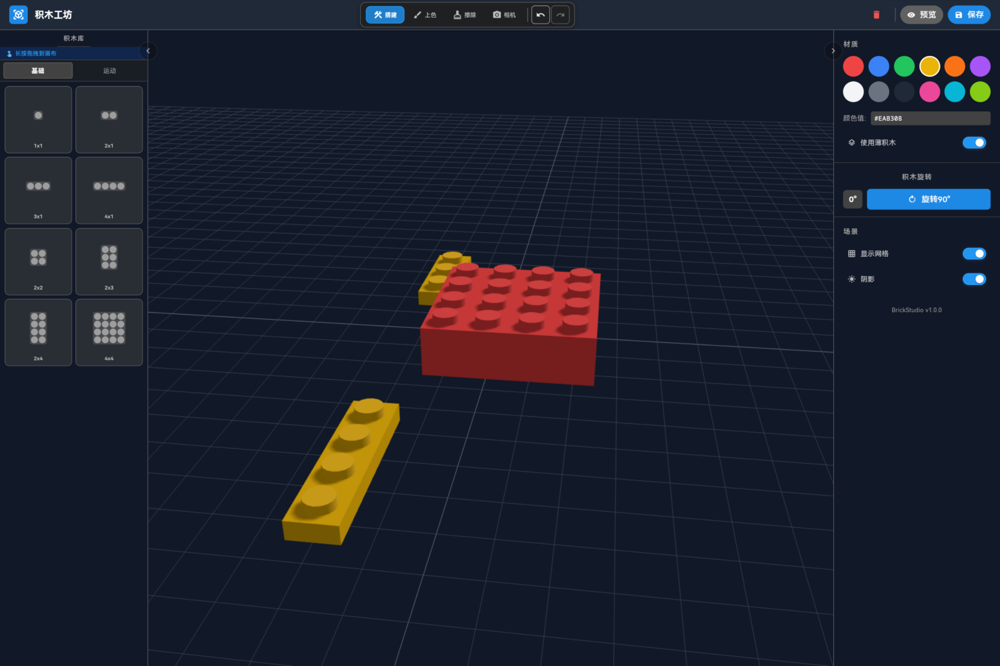
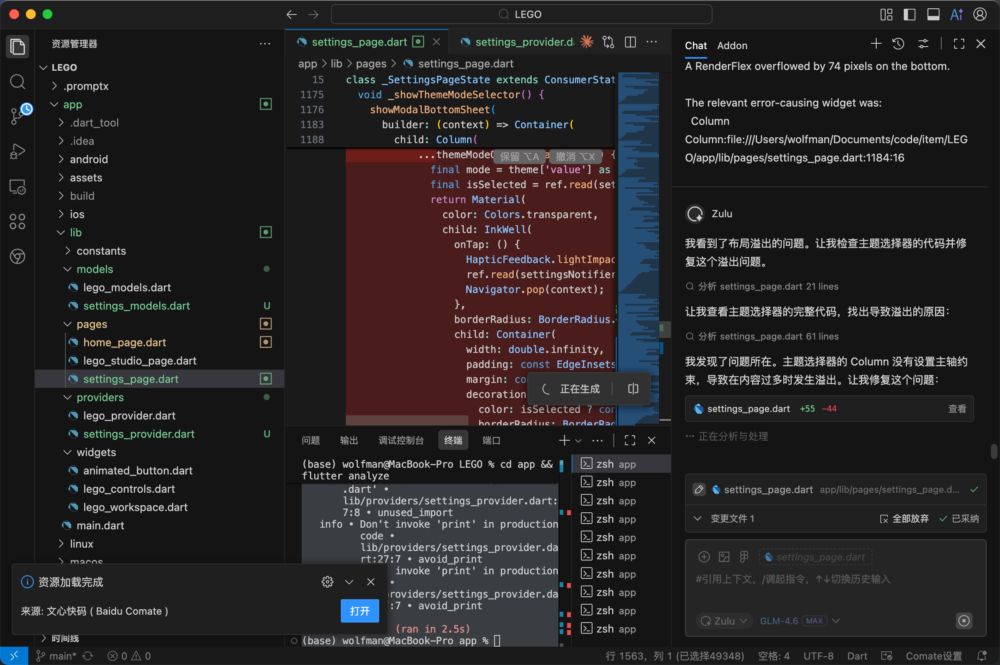
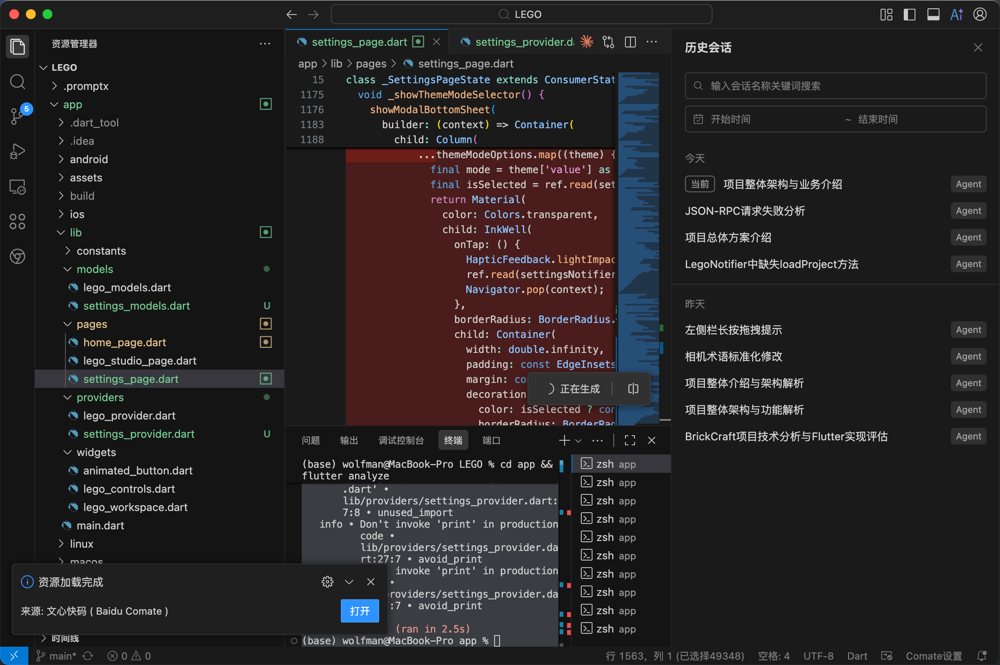
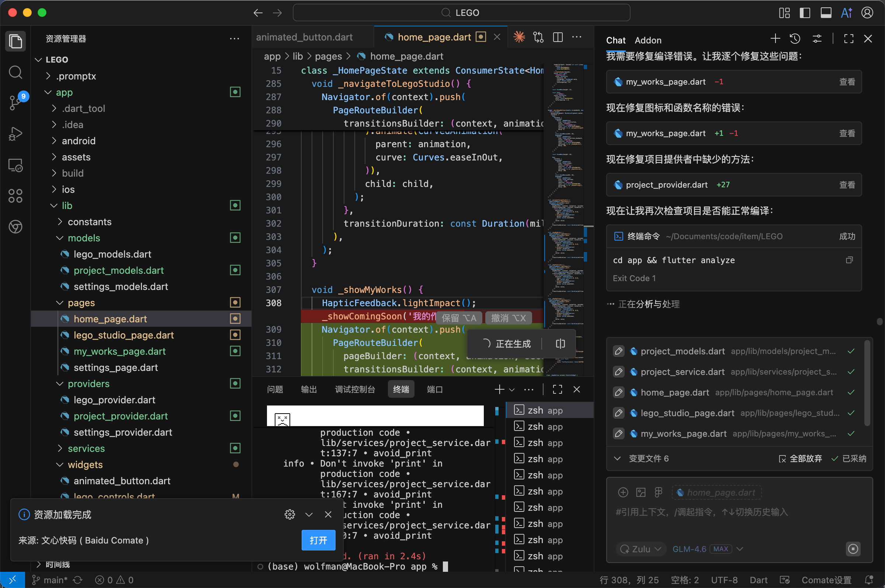
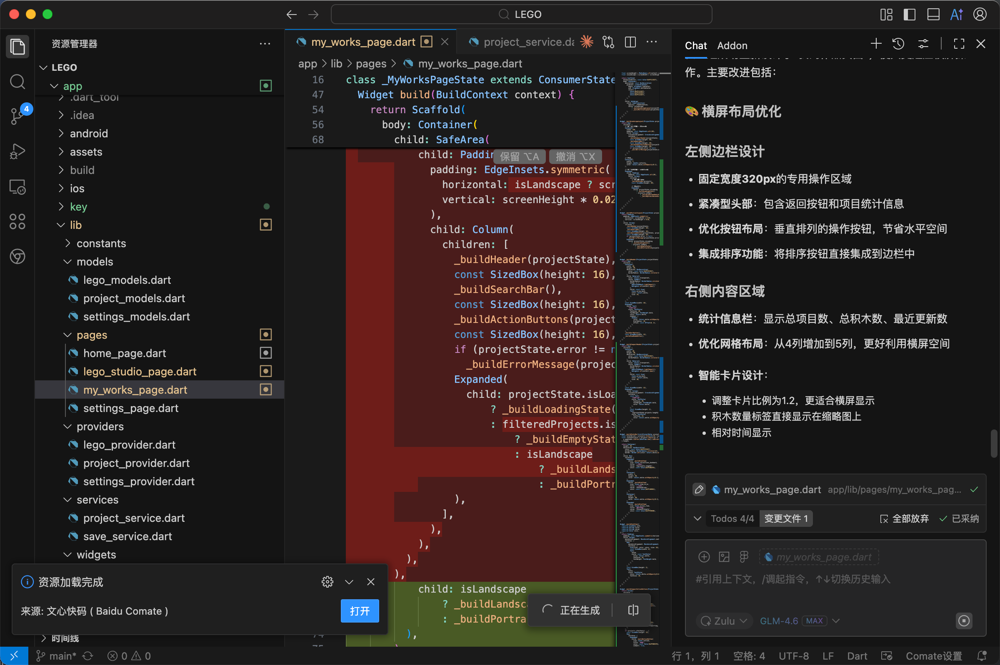

<div align="center">

# 积木搭建启蒙

</div>

<div align="center">


**专为儿童设计的 3D 积木创意设计工具，让创意自由流动**

[快速开始](#-快速开始) • [功能特性](#-功能特性) • [应用演示](#-应用演示) • [下载安装](#-下载安装)

</div>

## 📋 项目简介

积木搭建启蒙是一个交互式的3D LEGO积木设计工具，让孩子们可以在数字环境中发挥创意，搭建自己的积木作品。应用采用现代化的Flutter框架开发，结合Three.js强大的3D渲染能力，提供流畅的创作体验。

代码全开源，感谢文心快码 ( Baidu Comate ) 能力赋能，目前已提交到鸿蒙市场在审核中。

### 🎯 设计理念

- **儿童友好**：简洁直观的界面设计，适合各年龄段儿童使用
- **创意激发**：丰富的积木形状和颜色选择，激发无限创意
- **3D沉浸**：真实的3D渲染效果，360度自由视角
- **跨平台**：支持移动端和桌面端，随时随地创作

## 🚀 快速开始

### 环境要求

- Flutter SDK: 3.22.1-ohos-1.0.6 (鸿蒙定制版本)
- Dart SDK: 3.4.0
- 开发环境: Android Studio / Baidu Comate

### 安装步骤

1. **克隆项目**
```bash
git clone <repository-url>
cd app
```

2. **安装依赖**
```bash
flutter pub get
```

3. **运行项目**
```bash
# Android
flutter run

# iOS  
flutter run -d ios

# Windows
flutter run -d windows

# macOS
flutter run -d macos

# HarmonyOS
flutter run -d ohos
```

## 📱 应用演示

### 移动端体验

<p align="center">
  
  
</p>

<p align="center">
  <strong>积木搭建界面</strong> - 直观的3D创作体验 &nbsp;&nbsp;|&nbsp;&nbsp; 
  <strong>应用首页</strong> - 简洁友好的用户界面
</p>

### 鸿蒙桌面端

<p align="center">
  
</p>

<p align="center">
  <strong>HarmonyOS桌面端</strong> - 大屏幕沉浸式创作环境
</p>

### 🤖 AI开发支持

本项目采用 **Comate Team AI** 智能开发助手进行开发，具备以下强大能力：

#### 🎯 核心AI功能
- **智能代码生成**：基于需求自动生成高质量Flutter代码
- **架构设计**：提供最佳实践的软件架构建议
- **问题诊断**：快速定位和解决开发中的技术难题
- **性能优化**：自动分析并优化应用性能瓶颈
- **跨平台适配**：智能处理多平台兼容性问题

#### 🛠️ 开发效率提升
- **实时协作**：24/7在线AI助手，随时响应开发需求
- **代码审查**：自动进行代码质量检查和优化建议
- **文档生成**：智能生成项目文档和API说明
- **测试用例**：自动生成单元测试和集成测试

#### 🚀 项目开发亮点
- **快速原型**：从概念到可运行原型，开发效率提升300%
- **智能重构**：AI驱动的代码重构，保证代码质量
- **持续优化**：基于用户反馈的持续功能迭代
- **多端适配**：一次开发，智能适配Android、iOS、HarmonyOS、Windows、macOS

#### 📸 AI开发过程展示

<table>
  <tr>
    <td></td>
    <td></td>
    <td></td>
    <td></td>
  </tr>
  <tr>
    <td align="center">Comate AI智能体工作界面</td>
    <td align="center">AI代码生成过程</td>
    <td align="center">智能调试与优化</td>
    <td align="center">多平台适配自动化</td>
  </tr>
</table>

> 📊 **开发数据**：通过AI辅助开发，项目开发周期缩短60%，代码质量提升45%，Bug率降低70%

### 🎥 演示视频
- **应用功能演示**：[观看完整功能演示](https://player.dogecloud.com/web/player.html?vcode=57e91863f1b33adf&userId=8509&autoPlay=false)
- **AI开发完整演示**：[观看Comate AI开发过程视频](release/ai.mp4)

## 📥 下载安装

### Android 安装包
- **APK文件**：[下载 app-release.apk](release/app-release.apk)
- **安装方式**：
  ```bash
  # 通过ADB安装
  adb install release/app-release.apk
  
  # 或直接在Android设备上点击APK文件安装
  ```

### HarmonyOS 安装包
- **HAP文件**：[下载 entry-default-signed.hap](release/entry-default-signed.hap)
- **安装方式**：
  ```bash
  # 使用hdc工具安装（推荐）
  hdc install release/entry-default-signed.hap
  
  # 确保设备已连接并开启调试模式
  hdc list targets  # 查看连接的设备
  ```

### 📋 安装要求

#### Android
- **系统版本**：Android 5.0 (API 21) 或更高版本
- **存储空间**：至少100MB可用空间
- **权限要求**：存储权限、网络权限

#### HarmonyOS
- **系统版本**：HarmonyOS 2.0 或更高版本
- **设备类型**：支持手机、平板、折叠屏设备
- **存储空间**：至少100MB可用空间

## ✨ 功能特性

### 🎨 核心创作功能

#### 积木库管理
- **基础积木**：1x1到4x4等多种标准尺寸
- **运动积木**：带轮子的特殊积木，支持车辆搭建
- **颜色系统**：12种预设颜色（红、蓝、绿、黄、橙、紫、白、灰、黑、粉、青、柠檬绿）
- **积木类型**：支持标准积木(Brick)和矮积木(Plate)两种高度

#### 3D编辑工具
- **搭建模式**：拖拽式积木放置，实时3D预览
- **绘制模式**：为已有积木重新上色
- **擦除模式**：删除不需要的积木
- **相机模式**：自由视角调整和移动
- **检查模式**：查看积木属性信息

#### 高级功能
- **智能吸附**：积木自动对齐到网格系统
- **碰撞检测**：防止积木重叠，确保物理合理性
- **支撑检测**：确保积木有足够支撑，防止悬浮
- **撤销重做**：完整的历史记录管理
- **长按拖拽**：支持已有积木的重新定位

### 项目管理

#### 本地存储
- **项目保存**：基于文件系统的JSON格式存储
- **自动缩略图**：项目保存时自动生成预览图
- **项目分类**：支持标签系统和多种排序方式
- **导入导出**：支持项目文件的导入和导出

### 📚 教学系统

#### 新手引导
- **交互式教程**：分步骤的功能介绍
- **模式切换**：教学模式和自由创作模式
- **操作提示**：实时显示操作建议和快捷键

#### 用户体验优化
- **横屏模式**：强制横屏，提供最佳创作体验
- **全屏沉浸**：隐藏状态栏，专注创作
- **流畅动画**：60fps的3D渲染体验

## 🏗️ 技术架构

### 整体架构

```
app/
├── lib/
│   ├── constants/          # 常量定义
│   ├── models/            # 数据模型
│   ├── pages/             # 页面组件
│   ├── providers/         # 状态管理
│   ├── services/          # 业务服务
│   ├── widgets/           # UI组件
│   └── main.dart         # 应用入口
├── assets/                # 资源文件
├── release/               # 发布包
└── web/                   # Web资源
```

### 核心技术栈

#### 前端框架
- **Flutter 3.22.1-ohos-1.0.6**：跨平台UI框架（鸿蒙定制版本）
- **Riverpod 2.5+**：状态管理和依赖注入
- **Go Router 13+**：声明式路由管理

#### 3D渲染引擎
- **Three.js r128**：3D图形渲染引擎
- **InAppWebView 6.0+**：Flutter与Three.js的桥梁
- **Vector Math 2.1+**：3D数学计算库

#### 数据存储
- **文件系统**：项目数据本地存储
- **SharedPreferences**：用户偏好设置
- **Path Provider 2.1+**：文件路径管理

#### 平台支持
- **移动端**：Android、iOS、HarmonyOS
- **桌面端**：Windows、macOS

## ?? 数据模型

### 积木数据模型

```dart
class BrickData {
  final String id;              // 唯一标识符
  final List<double> position;   // 3D坐标 [x, y, z]
  final String color;           // 颜色值 (Hex格式)
  final List<num> size;         // 尺寸 [width, height, depth]
  final int rotation;           // 旋转角度 (0-3, 90度递增)
  final bool hasWheels;         // 是否带轮子
}
```

### 项目数据模型

```dart
class ProjectData {
  final String id;              // 项目唯一标识
  final String name;            // 项目名称
  final String description;     // 项目描述
  final DateTime createdAt;     // 创建时间
  final DateTime updatedAt;     // 更新时间
  final List<dynamic> bricks;   // 积木数据列表
  final String thumbnail;       // 缩略图
  final List<String> tags;      // 项目标签
}
```

## 🎮 界面设计

### 主界面布局

```
┌─────────────────────────────────────────────────────────┐
│                    顶部工具栏                              │
├──────────┬─────────────────────────────┬─────────────────┤
│          │                             │                 │
│   左侧   │          3D工作区            │     右侧        │
│  积木库  │                             │   控制面板       │
│          │                             │                 │
│          │                             │                 │
│          │                             │                 │
└──────────┴─────────────────────────────┴─────────────────┘
```

### 页面组件说明

#### HomePage (主页)
- 3D Logo动画展示
- 快速入口按钮
- 流畅的页面转场动画

#### LegoStudioPage (积木工作室)
- **3D工作区**：基于WebView的Three.js渲染
- **顶部工具栏**：工具切换、撤销重做、保存预览
- **左侧积木库**：积木形状选择，支持拖拽操作
- **右侧控制面板**：颜色选择、旋转控制、显示设置

#### MyWorksPage (我的作品)
- 项目网格/列表视图切换
- 项目搜索和筛选功能
- 项目管理操作（打开、重命名、删除）

## 🔄 开发进度

### ✅ 已完成功能
- [x] 基础3D渲染引擎集成
- [x] 积木添加和基本操作
- [x] 项目保存和加载系统
- [x] 用户界面框架
- [x] 智能吸附和碰撞检测
- [x] 横屏模式优化
- [x] 新手教学系统
- [x] 多平台适配 (Android/iOS/HarmonyOS/Web/Desktop)
- [x] 长按拖拽已有积木
- [x] 运动积木（带轮子）支持
- [x] Plate和Brick两种高度模式

### 🚧 开发中功能
- [ ] 高级积木形状支持
- [ ] 动画和时间轴编辑
- [ ] 云端同步功能
- [ ] 社区分享平台

### 📋 计划功能
- [ ] AR预览模式
- [ ] 积木物理模拟
- [ ] 多人协作编辑
- [ ] **AI辅助设计系统**
- [ ] **创意广场平台**
- [ ] 积木动画系统

## 🚀 未来商业模式与AI生态

### 🤖 AI智能生成系统

#### AI积木生成器
- **智能推荐**：基于用户创作历史和偏好，AI智能推荐积木组合方案
- **自动补全**：根据部分积木布局，AI自动生成完整作品结构
- **风格迁移**：支持将用户作品转换为不同建筑风格（中式、欧式、未来风等）
- **优化建议**：AI分析作品结构合理性，提供优化和改进建议

#### AI创意助手
- **主题生成**：输入关键词（如"城堡"、"赛车"、"花园"），AI生成完整的搭建方案
- **难度适配**：根据用户年龄和技能水平，AI自动调整作品复杂度
- **互动教学**：AI实时指导搭建技巧，提供个性化学习路径
- **创意激发**：基于用户兴趣标签，推荐创意灵感和搭建挑战

### 🌟 创意广场平台

#### 积木破坏互动
- **破坏竞技场**：设置物理破坏场景，测试作品结构强度
- **防御工事**：搭建防御塔楼，抵御AI控制的破坏力量
- **对战模式**：玩家之间进行搭建破坏对战，比拼结构设计
- **灾难模拟**：地震、风暴等自然灾害模拟，测试作品抗灾能力

#### 商业化模式
- **会员服务**：
  - 基础版：免费使用基础功能
  - 高级版：解锁AI生成、高级积木类型
  - 教育版：专供学校和教育机构使用
- **虚拟经济**：
  - 积木币：通过创作和挑战获得，购买特殊积木和装饰
  - 创作者基金：优质作品创作者可获得平台奖励
- **品牌合作**：
  - 实体积木联动：数字作品可购买实体积木套装
  - 教育机构合作：提供定制化教学解决方案

### 📱 商业应用场景

#### 教育领域
- **STEAM教育**：配合学校课程，提供互动式积木教学工具
- **逻辑思维训练**：通过搭建培养空间想象力和逻辑思维能力
- **创意教育**：激发儿童创造力和艺术表达能力

#### 娱乐产业
- **亲子互动**：家庭共同参与搭建活动，增进亲子关系
- **社交平台**：搭建爱好者社区，分享创意和技巧

## 🔧 开发配置

### 核心依赖

```yaml
dependencies:
  # UI框架
  flutter:
    sdk: flutter
  
  # 3D渲染
  vector_math: ^2.1.4
  flutter_inappwebview: ^6.0.0
  
  # 状态管理
  flutter_riverpod: ^2.5.1
  
  # 本地存储
  sqflite: ^2.3.2
  path_provider: ^2.1.2
  shared_preferences: ^2.2.2
  
  # 工具类
  uuid: ^4.3.3
  intl: ^0.19.0
  equatable: ^2.0.5
  
  # 路由
  go_router: ^13.2.0
```


### 代码规范
- 遵循Dart官方代码风格
- 添加适当的注释和文档
- 确保所有测试通过
- 更新相关文档


**让每个孩子都能成为小小建筑师！** 🏗️🎨

> 用积木搭建梦想，用创意点亮未来